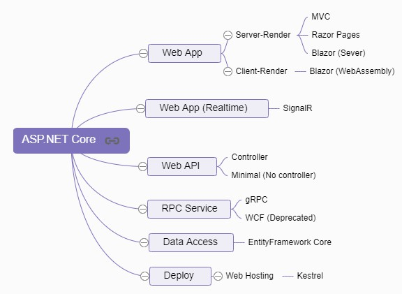

# ASP.NET CORE

- [ASP.NET CORE](#aspnet-core)
  - [web app](#web-app)
    - [server rendered](#server-rendered)
    - [client rendered](#client-rendered)
  - [web app (realtime)](#web-app-realtime)
  - [hosting \& deploy](#hosting--deploy)
  - [Performance](#performance)
  - [Sample Projects](#sample-projects)

## web app
Basically it's a website. Technically it's divided into server-rendered and client-rendered. Client-rendered can be more fluent and work offline.

### server rendered

- [Razor Pages](https://docs.microsoft.com/en-us/aspnet/core/razor-pages/?view=aspnetcore-6.0&tabs=visual-studio)
- [MVC](https://docs.microsoft.com/en-us/aspnet/core/mvc/overview?view=aspnetcore-6.0)
- [Blazor](https://docs.microsoft.com/en-us/aspnet/core/blazor/?view=aspnetcore-6.0) (Server)

`Razor Pages` is for simple pages website, while `MVC` is for complex ones.

`Blazor(server)` is based on `Razor Components`. Unlike other solutions to render whole html to client, `Blazor(server)` keeps the client rendering state, and send only diff-binary to client for rendering, via `SingalR`.

### client rendered

- [Blazor](https://docs.microsoft.com/en-us/aspnet/core/blazor/?view=aspnetcore-6.0) (WebAssembly)

`Blazor(client)` is based on `Razor Components`, too. Underneath it use `WebAssembly` to play with DOM. As a result, you can write/debug c# rather than js for web development. But currently (2022.12) its download-size and execution-speed is not good enough.

## web app (realtime)

[SingalR](https://learn.microsoft.com/en-us/aspnet/core/signalr/introduction) is a library for real-time web apps.

SingalR uses `WebSockets`(based on http2, see [here](https://learn.microsoft.com/en-us/aspnet/core/fundamentals/websockets))/`Server-Sent Events`/`Long Polling` (fallback order) technique to achieve realtime server push to clients. Communications are through `hub` (based on `json` or `messagepack`).

Scenario:
- game, chat room, voting, map/GPS app
- dashboard, alerts, sales update
- team meeting, white board

## hosting & deploy

A `host` is an object that encapsulates an `app`'s resources. The host server is responsible for app startup and lifetime management. `deploy` is the action to publish a `app` to a folder on `host` server.

[Host server for ASP.NET Core](https://learn.microsoft.com/en-us/aspnet/core/fundamentals/servers/):
- [Kestrel](https://docs.microsoft.com/en-us/aspnet/core/fundamentals/servers/kestrel), default choice for cross-platform.
- [IIS](https://learn.microsoft.com/en-us/aspnet/core/host-and-deploy/iis/), windows only
- Azure App Service, cloud

Hosting environment also include a process manager (to start/restart app), a reverse proxy (optional, to forward requests to the app).

Process manager for ASP.NET Core:
- Linux
  - [Nginx](https://docs.microsoft.com/en-us/aspnet/core/host-and-deploy/linux-nginx)
  - [Apache](https://docs.microsoft.com/en-us/aspnet/core/host-and-deploy/linux-apache)
- Windows
  - [IIS](https://docs.microsoft.com/en-us/aspnet/core/host-and-deploy/iis/)
  - Windows Service

Above choice can also be used as reverse proxy if using `Kestrel` server ([When-To-Use](https://learn.microsoft.com/en-us/aspnet/core/fundamentals/servers/kestrel/when-to-use-a-reverse-proxy)).

> In code, [`web host`]((https://docs.microsoft.com/en-us/aspnet/core/fundamentals/host/web-host?view=aspnetcore-3.1)) is for old-version-compatibility. [`generic host`]((https://docs.microsoft.com/en-us/aspnet/core/fundamentals/host/generic-host?view=aspnetcore-3.1)) is modern, and not only for ASP.NET, but also for Console App.

## Performance
As a backend framework, it's top tier, from [TechPower benchmark](https://www.techempower.com/benchmarks/#hw=ph&test=plaintext&section=data-r21). And its said to be 20x faster for a real-world project migrated from `Node.js`.

## Sample Projects

- [`ToDo List` backend, various implementations](https://github.com/davidfowl/Todos)
- [`ToDo List` web app](https://github.com/davidfowl/TodoApi), using Blazor WASM, Minimal API, EntityFramework and SQLite, JWT/Cookie auth, etc.
- [TriviaR](https://github.com/davidfowl/TriviaR/tree/3a875f98dbb0a414e3a3c7360edac8dadd629971), a multiplayer trivia game(turn-based) using SignalR and .NET 7