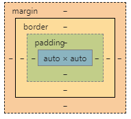
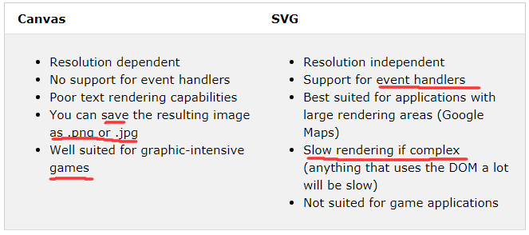

## Content

- [HTML4](#html4)
    + [a html file](#a-html-file)
    + [CSS box model](#css-box-model)
    + [Element, Tag, Attribute](#element--tag--attribute)
    + [CSS](#css)
    + [block vs inline](#block-vs-inline)
    + [class](#class)
    + [id](#id)
    + [responsive](#responsive)
    + [forms](#forms)
    + [Entites & symbols](#entites---symbols)
    + [URL encoding](#url-encoding)
    + [JSON](#json)
    + [DOM](#dom)
    + [`window`](#-window-)
- [HTML5](#html5)
    + [new elements](#new-elements)
    + [new APIs](#new-apis)
- [HTML Game](#html-game)

---

HTML online exercise : https://www.w3schools.com/html/exercise.asp

---

## HTML4

#### a html file

```html
<!DOCTYPE html>
<html>
	<head>
		<title>
		...
	</head>
	<body>
		...
	</body>
</html>
```

#### CSS box model



#### Element, Tag, Attribute

element can be nested.

below is an "element".

```html
<tagname attri_name1="xxx" attri_name2="xxx"> content </tagname>
```

some tags

| tags   | details                                         |
| ------ | ----------------------------------------------- |
| image  | `` support gif, backgroud-image            |
| table  | `<table> <th> <td> <tr> `                       |
| list   | `<ul> <li>`                                     |
| iframe | webpage in webpage                              |
| script | use js to change element's style and attributes |

#### CSS

| type     | example                                                      |
| -------- | ------------------------------------------------------------ |
| inline   | `<tagname style = "property:value;">  `                      |
| internal | `<style>` element in `<head>` block                          |
| external | `<link rel = "stylesheet" href =  "xxxx.css">`  in  `<head>` block |

for same tag, inline CSS will override internal/external CSS.


#### block vs inline

block: always new line. strentch horizontally as much as possible. e.g. `<div>`

inline: strentch if necessary. e.g. `<span>`


#### class

elements with same class share same style.

def in CSS:  `.className { key:value}`

use in JS:  `document.getElementByClassName(xxx)`


#### id

identify a unique element. also used as bookmarks.

def in CSS:  `#idName {key:value}`

use in HTML: `<a href="#idName>xxx</a>`

use in JS:  `document.getElementById(xxx)`


#### responsive

adaptive to screensize. 

- add `<meta name = "viewport" content = "width=device-width, initial-scale=1.0">` in head

- use 'xx%' rather than '100px'

use framework to design this.


#### forms

```html
<form action ="/xxx.php" method="yyy" attibute>
  form elements
</form>
```

method can be `GET` or `POST`. use `GET` will append input data to url.

attribute can be `novalidate`, `autocomplete`.

form element:

| type                                     | details                                                      |
| ---------------------------------------- | ------------------------------------------------------------ |
| `<input type = "xxx" attribute>  `       | type can be text, radio, submit, range, number, password,  email...see [here](https://www.w3schools.com/html/html_form_input_types.asp)     attibute see [here](https://www.w3schools.com/html/html_form_attributes.asp) |
| `<select>, <option>  `                   | drop-down list                                               |
| ` <textarea>  `                          |                                                              |
| `<button type="button" onclick="xxx">  ` |                                                              |


#### Entites & symbols

| name                |            |
| ------------------- | ---------- |
| >                   | `&gt;`     |
| <                   | ` &lt;`    |
| non-breaking space  | ` &nbsp;`  |
| non-breaking hyphen | ` &#8209;` |

See [entities](https://www.w3schools.com/html/html_entities.asp) and [symbols](https://www.w3schools.com/html/html_symbols.asp) in w3schools.


#### URL encoding

URL can only be sent over the Internet using the ASCII char-set.


#### JSON

- subset of js syntax
  - Data is in name/value pairs
  - Data is separated by commas
  - Curly braces hold objects
  - Square brackets hold arrays

- `JSON.stringify`, `JSON.parse`

 

#### DOM

construct html/xml as a tree of objects. Implemented by browser, not js.

js can access these objects by HTML DOM API.

```js
document.getElementById/createElement
parentNode.appendChild
element.innerHTML/styles/setAttribute/addEventListener
```


DOM event flow

- capture phase
- target phase
- bubbleing phase


Virtual DOM

- DOM node contains too much data to boost performance.
- Use virtual DOM instead.
  - Use js to construct a virtual DOM.
  - Use virtual one to generate real DOM.
  - Diff virtual DOM and update part of real DOM.

- Framework like React uses this tech.


#### `window`

a global object as root. Implemented by browser, not js.

provide useful functions e.g. `setTimeOut, setInterval`

provide useful properties e.g. `screen, history,location`


## HTML5

#### new elements

New semantic elements like `<header>, <footer>, <article>`, and `<section>`.

New attributes of form elements like number, date, time, calendar, and range.

New graphic elements: `<svg>` and `<canvas>`.

- `<svg>` is used to draw scalable-vector graphics via XML.

- [`<canvas>`](https://www.w3schools.com/graphics/canvas_intro.asp) is a container which used to draw graphics via JavaScript.

  - e.g.

    ```js
    var c = document.getElementByID("myCanvas");
    var ctx = c.getContext("2d");
    ctx.moveTo(0,0);
    ctx.LineTo(200,100);
    ctx.stroke();
    ```

- diff between `<svg>` and `<canvas>`

  `<canvas>` is drawn on the fly, pixel by pixel. Any changes will redraw the entire scene.

  `<svg>` is drawn as an object in the SVG DOM. Any changes on one object will redraw it automatically.

  

New multimedia elements: `<audio>` and `<video>`. but the easiest way to play video is to use youtube.

```html
<iframe width="1080" height="720" src="xxx">
```


#### new APIs

- HTML Geolocation
- HTML [Drag and Drop](https://www.w3schools.com/html/html5_draganddrop.asp)
  - every element in html5 can be draggable.
  - attibute: draggable, ondragstart, ondragover, ondrop

- HTML Local Storage
  - HTML web storage is better than cookie. It never transferred to th eserver.
  - window.localStorage (K-V pair)
  - window.sessionStorage (destroyed when tab closed)

- HTML Application Cache
- **HTML Web Workers**
  
  - Web workers are **real** multi-threads.
  - To keep simplicity, workers and main thread(webpage) don't share data.
    - workers cannot access DOM
    - main thread push data to workers by clone. (`worker.postMessage` function)
    - workers return data to main thread by event.(`worker.onmessage` handler)
    - also see [here](https://stackoverflow.com/questions/9708113/since-javascript-is-single-threaded-how-are-web-workers-in-html5-doing-multi-th).
- Web workers are not part of javascript but a browser feature. Usage see [here](https://developer.mozilla.org/en-US/docs/Web/API/Web_Workers_API/Using_web_workers).
  
- HTML SSE (Server-Sent Events)

  e.g. Twitter uptes, stock price updates, etc.

  new a EventSource object and add a handler to its `onmessage`

- html4 migration

  https://www.w3schools.com/html/html5_migration.asp


## HTML Game

Use Canvas to render.

Use `<body onload="StartGame">` to call StartGame().

Use `setInterval(update, 16)` in StartGame() to start the Game loop `update`.

Use callback from html tag to call js handler. Or you can add keyboard handler to window.

Clear canvas before draw new graphics in `update`.